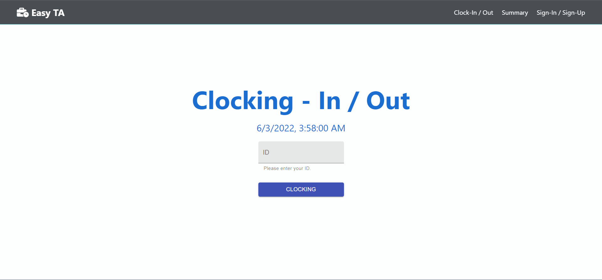
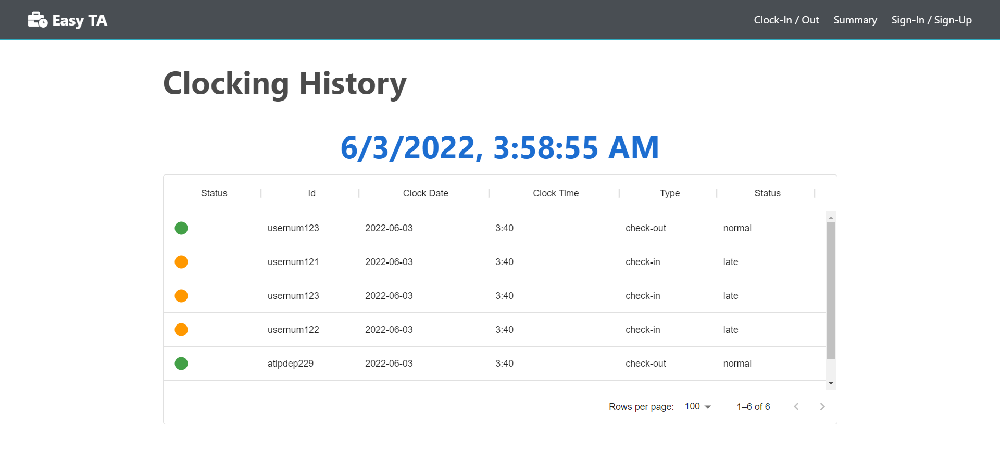
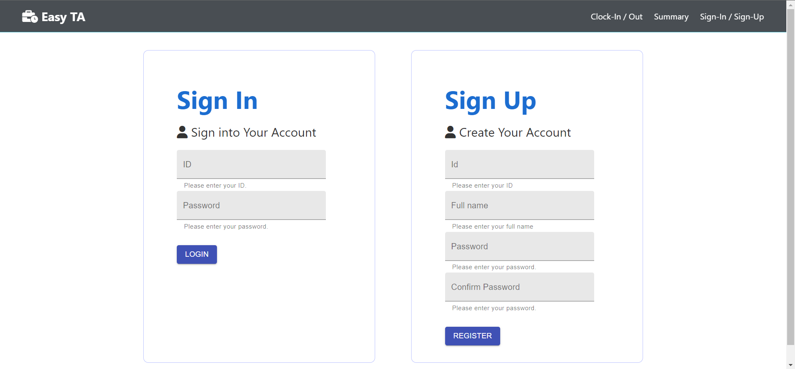

## About The Project

Easy Time Attendance is the software builded up in the concept of easy and simple to use for stamp user working time.

Main features
* User clocking, user enter ID 10 characters to clocking and stamp working time into system, and will showing in summary menu.
* Clocking history, in navigation bar is titled Summary menu, that show all user clocking history, will provide id, date, time, clocking type, clocking status in table.
* Sign-In and Sign-Up, in navigation bar is titled Sign-In / Sign-Up menu, user can create account and login then user's id will auto enter in clocking id input field.

## Getting Started

Follow this step to run app in local machine.
1. Install package for express server
```sh
  npm install
```
2. Install client package for react 
```sh
  cd client
  npm install
```
3. Run application by cd back to root project and run Express and Client
```sh
  cd ..
  npm run dev
```

## License

Distributed under the MIT License. See `LICENSE` for more information.

## Contact

Atip Yongstar - [LinkedIn](https://www.linkedin.com/in/atip-yongstar-5118b5186/) - atipdev.y@gmail.com

Project Link: [https://github.com/your_username/repo_name](https://github.com/your_username/repo_name)

<!-- ACKNOWLEDGEMENTS -->
## Acknowledgements
* [Project structure and style reference](https://github.com/bradtraversy/devconnector_2.0)
* [Reading and writing json file with node](https://stackabuse.com/reading-and-writing-json-files-with-node-js/)
* [Material UI](https://mui.com/)
